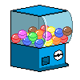
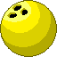
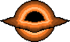
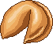
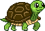
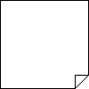

  
  
  
  
  
  
  

# Gacha-Widget
**Gacha-Widget**을 통해 몇 가지의 위젯을 뽑아 상호작용을 확인하세요!

## 시연 영상

  

## 주요 위젯

| 위젯 이미지 | 설명 |
| ----- | ----- |
| 

 | Gacha Machine입니다. (좌클릭을 통해 위젯을 뽑을 수 있고, 우클릭을 통해 초기화 혹은 종료가 가능합니다.) |
| 

 | 아스파라거스입니다. 거북이가 좋아할 것 같습니다! |
| 

 | 공입니다. 꽤 무겁습니다! |
| 

 | 블랙홀입니다. 무엇이든 빨려들어갑니다! |
| 

 | 말 그대로 시계입니다. (실제 이미지와 다를 수 있습니다.) |
| 

 | 구름입니다. 알아서 잘 돌아다닙니다! |
| 

 | 행운의 쿠키입니다. '뜻밖의 행운'을 찾아보세요! |
| 

 | 거북이입니다. 공에 깔리지 않게 조심하세요! |
| 

 | 메모장입니다. 글씨가 작아 안보일지도 모릅니다! |

## 사용 방법 및 추가 사항

파일을 다운로드 하여 **main.py**를 실행하면 Gacha Machine이 나타납니다.  
클릭을 통해 다른 위젯을 뽑을 수 있으며, 위젯 간의 간단한 상호작용이 존재합니다.  
위젯들을 클릭하거나 드래그해 움직여 가면서 상호작용을 확인해 보세요.

[여기](https://drive.google.com/file/d/1AD7sd41y9z1qHb9rLoMkDNbZ8Adlvb9T/view?usp=sharing)를 눌러 exe파일을 다운로드 받을 수도 있습니다.  
exe파일은 레포지토리의 파일 들을 요구하지 않습니다.

❗Windows 환경을 기준으로 작성된 프로그램으로, 다른 플랫폼에서는 원활하게 작동하지 않을 수 있습니다.  
❗프로그램에 사용된 모든 이미지는 assets 폴더에 저장되어 있으며, 제작자가 직접 그림판으로 도트 이미지를 그렸음을 밝힙니다.

